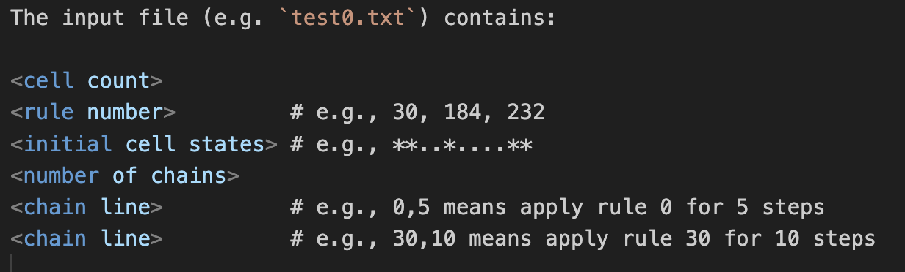
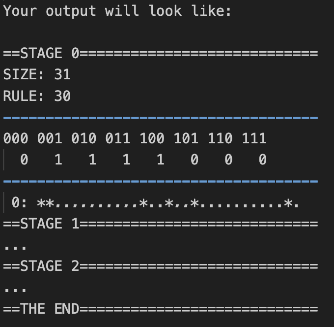

# 🧬 Cellular Automaton Simulator – COMP10002 Assignment 2

This C program simulates **elementary 1D cellular automata** and solves the **density classification problem** using logic and dynamic data structures. Developed as part of the University of Melbourne's **COMP10002 Foundations of Algorithms** subject (Year 1, Semester 2, 2024).

This program reads rules and inputs describing the automaton's size, initial states, and update logic, and produces simulations across multiple stages including cell state evolution and classification.

---

## 📘 What It Does

This program:

- Reads rules and initial cell configurations from `stdin`
- Simulates cell evolution using elementary automata rules
- Displays state progression across multiple stages
- Solves the **density classification problem** with chained rule application
- Outputs a formatted summary including state count, pattern evolution, and classification

---

## 💡 My Learning & Growth

- During this assignment, I earned how to implement **linked data structures**, including linked lists and use of pointers, in C to simulate automata states. With careful implementations of malloc() and free(), I practiced **memory-safe programming** using dynamic allocation and manual memory management. 
- I also strengthened debugging, file I/O, and test-driven development skills, working through edge cases in rule processing and state validation.
- Cellular Automation was a new concept for me, and doing this assignment allowed me to gain a strong understanding of **automaton theory**, how to model state evolution, and how it is useful in various fields.
- Through the interative process of program development and debugging, I understood how C is a more manual and care-requiring tool than other programming laguages and performed delicate manipulation of the data.
- The tasks seemed very complicated and challenging at first, especially with C being a less intuitive and understandable language structure. But, with a patient division of subtasks, I was able to solve the automation problem step by step and eventually reach the desired outcome.
- This assigment took around a week to complete. Through scheduling and active engagement, I performed a series of productive development stages and found the process greatly rewarding. 

---

## 🚀 How the Program Runs

1. **Compile** the C program
2. Run with **Sample Input** provided in tests folder: for example, with the input
file tests/test0.txt, the output would be like tests/test0-out.txt.
3. Create other input files: 
    - Input Format: 
    

    - Output Format
    

4. **Testing**: test0.txt and test1.txt test rule combinations, chain effects, and cell behavior. More tests can be added inside the tests/ folder and be run and tested in the same way.
5. The program output shows simulation steps and indicates whether the density classification succeeded. Please refer to the assignment description in the docs folder for more information on the use of cellular automation.

---

🎓 Additional Information
- Author: Jiani Li
- Subject: COMP10002 Foundations of Algorithms
- University: University of Melbourne
- Project Mark: 20/20